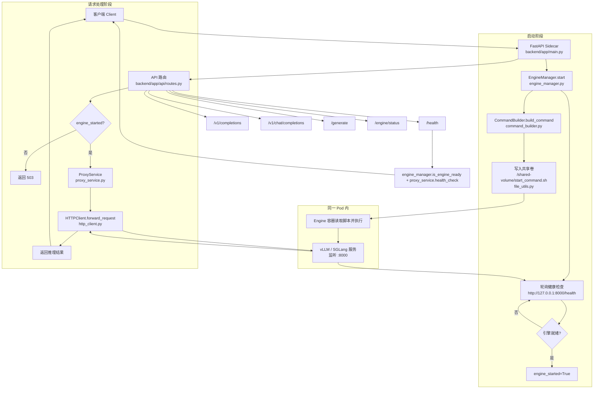

# Infer Control Sidecar Logic Diagram

```mermaid
flowchart TD
    A[客户端 Client] --> B[FastAPI Sidecar<br/>backend/app/main.py]
    B --> C[API 路由<br/>backend/app/api/routes.py]

    subgraph Startup[启动阶段]
      B --> D[EngineManager.start<br/>engine_manager.py]
      D --> E[CommandBuilder.build_command<br/>command_builder.py]
      E --> F[写入共享卷<br/>/shared-volume/start_command.sh<br/>file_utils.py]
      D --> G[轮询健康检查<br/>http://127.0.0.1:8000/health]
      G --> H{引擎就绪?}
      H -- 否 --> G
      H -- 是 --> I[engine_started=True]
    end

    subgraph Pod[同一 Pod 内]
      F --> J[Engine 容器读取脚本并执行]
      J --> K[vLLM / SGLang 服务<br/>监听 :8000]
      K --> G
    end

    subgraph Runtime[请求处理阶段]
      C --> L{engine_started?}
      L -- 否 --> M[返回 503]
      L -- 是 --> N[ProxyService<br/>proxy_service.py]
      N --> O[HTTPClient.forward_request<br/>http_client.py]
      O --> K
      K --> O
      O --> P[返回推理结果]
      P --> A
    end

    C --> Q["/health"]
    Q --> R[engine_manager.is_engine_ready + proxy_service.health_check]
    R --> A

    C --> S["/v1/completions"]
    C --> T["/v1/chat/completions"]
    C --> U["/generate"]
    C --> V["/engine/status"]
```
