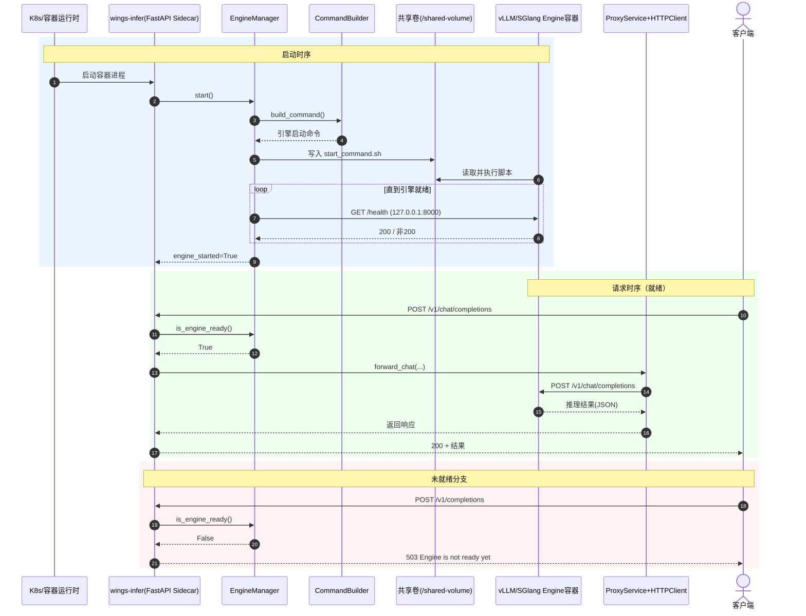

# Infer Control Sidecar 时序图（启动 + 请求）

```mermaid
sequenceDiagram
    autonumber
    participant K as K8s/容器运行时
    participant S as wings-infer(FastAPI Sidecar)
    participant M as EngineManager
    participant C as CommandBuilder
    participant V as 共享卷(/shared-volume)
    participant E as vLLM/SGlang Engine容器
    participant P as ProxyService+HTTPClient
    actor U as 客户端

    rect rgb(235, 245, 255)
    note over K,E: 启动时序
    K->>S: 启动容器进程
    S->>M: start()
    M->>C: build_command()
    C-->>M: 引擎启动命令
    M->>V: 写入 start_command.sh
    E->>V: 读取并执行脚本
    loop 直到引擎就绪
      M->>E: GET /health (127.0.0.1:8000)
      E-->>M: 200 / 非200
    end
    M-->>S: engine_started=True
    end

    rect rgb(238, 255, 238)
    note over U,E: 请求时序（就绪）
    U->>S: POST /v1/chat/completions
    S->>M: is_engine_ready()
    M-->>S: True
    S->>P: forward_chat(...)
    P->>E: POST /v1/chat/completions
    E-->>P: 推理结果(JSON)
    P-->>S: 返回响应
    S-->>U: 200 + 结果
    end

    rect rgb(255, 242, 242)
    note over U,S: 未就绪分支
    U->>S: POST /v1/completions
    S->>M: is_engine_ready()
    M-->>S: False
    S-->>U: 503 Engine is not ready yet
    end
```
