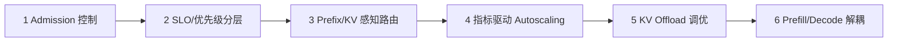

# 基于 vLLM 的控制面实施顺序说明

本文件给出六类机制的最小落地顺序。

## 建议实施顺序

1. Admission + token budget 控制
2. 请求分级与优先级调度
3. Prefix/KV 感知路由
4. 基于 LLM 指标的 autoscaling
5. KV 分层/offload 调优
6. Prefill/decode 解耦

## 落地流程图

## 为什么按这个顺序

- 第 1 到 4 步可以较快获得稳定性，且架构改动风险较低。
- 第 5 步在基线稳定后增强内存韧性。
- 第 6 步架构变更最大，建议最后实施。

## 需要优先锁定的 vLLM 原生参数

- `--max-num-batched-tokens`
- `--max-num-seqs`
- `--scheduling-policy`
- `--scheduler-cls`
- `--gpu-memory-utilization`
- `--kv-offloading-size`
- `--kv-transfer-config`

以上参数入口都在 `vllm/engine/arg_utils.py`。
