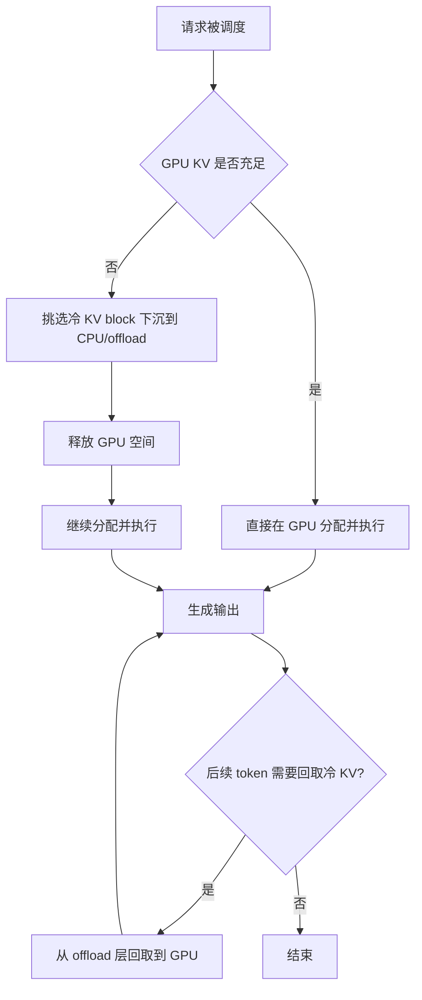

# 基于 vLLM 的 KV 分层与 Offload

## 目标

把部分 KV 压力从 GPU 内存转移到低层存储，缓解 KV 饱和，同时把尾时延控制在可接受范围内。

## 基本工作机制

1. 热 KV 留在 GPU。
2. 冷 KV block 下沉到 CPU/offload 层。
3. 序列恢复时按需回取。
4. 与 admission 联动，避免频繁抖动和来回迁移。

## 方案流程图

## 与 vLLM 的对接点

- 缓存与内存参数：
  - `gpu_memory_utilization`
  - `kv_cache_memory_bytes`
  - `kv_offloading_size`
  - `kv_offloading_backend`
  - 参考：`vllm/config/cache.py`
- CLI 参数：
  - `--gpu-memory-utilization`
  - `--kv-offloading-size`
  - 参考：`vllm/engine/arg_utils.py`
- KV offload 模块：
  - `vllm/v1/kv_offload`

## 最小部署形态

1. 先把 GPU KV 余量参数调稳定。
2. 以小规模开启 KV offload。
3. 重点观察：
   - TTFT
   - ITL tail
   - preemption 增长
4. 逐步提升 offload 层容量。

## MVP 调优顺序

1. 先用 offload 关闭状态建立基线。
2. 把 `kv_offloading_size` 设置为保守值。
3. admission 阈值先不变。
4. 对比生产回放流量下的 p95 与 p99 延迟。

## 为什么适配 vLLM

vLLM 已支持 KV offload 路径；你需要做的是策略和调优边界，控制“何时有收益、何时反伤”。

## 风险与护栏

- 风险：offload 带宽成为瓶颈，拉高时延。
- 护栏：限制 offload 大小并监控回取延迟。
- 风险：offload 掩盖入口治理不足。
- 护栏：admission 与 routing 控制必须持续开启。
