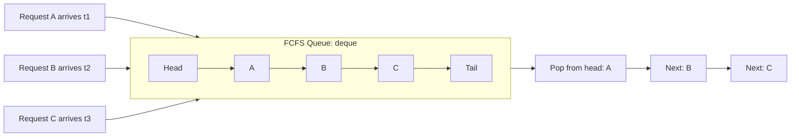
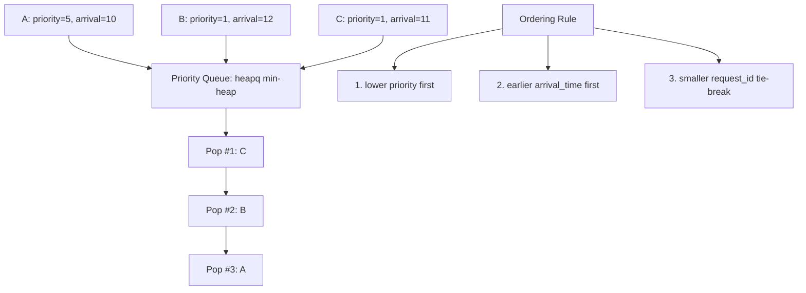
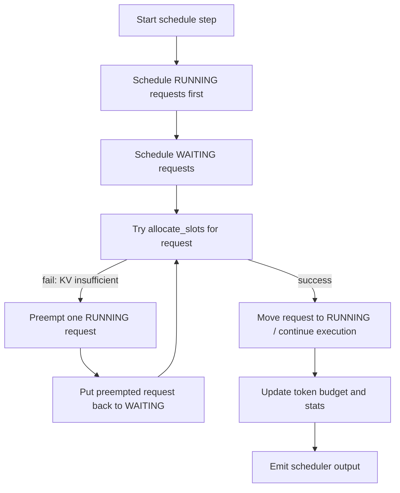
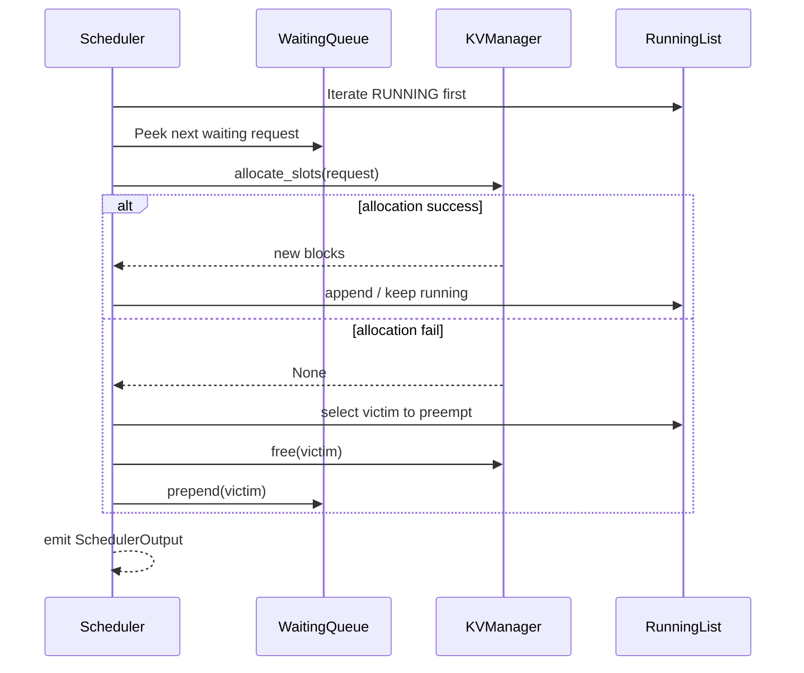

# Queue Policy Visualization (vLLM V1)

## 1. FCFS waiting queue



Mechanism:
- enqueue: `append`
- dequeue: `popleft`
- data structure: `deque`

Code:
- `vllm/v1/core/sched/request_queue.py` (`FCFSRequestQueue`)

## 2. Priority waiting queue



Mechanism:
- enqueue: `heappush`
- dequeue: `heappop`
- comparator: `Request.__lt__`

Code:
- `vllm/v1/core/sched/request_queue.py` (`PriorityRequestQueue`)
- `vllm/v1/request.py` (`__lt__`)

## 3. Scheduler main loop (shared by both policies)



Code:
- `vllm/v1/core/sched/scheduler.py` (`schedule`)
- `vllm/v1/core/kv_cache_manager.py` (`allocate_slots`)

## 4. Preemption behavior difference

```mermaid
flowchart LR
  K[KV allocation fails] --> D{Policy}
  D -->|priority| P1[Preempt lowest-priority RUNNING request]
  D -->|fcfs| P2[Preempt tail RUNNING request \n self.running.pop()]
  P1 --> W1[Request status -> PREEMPTED]
  P2 --> W1
  W1 --> W2[Free KV blocks]
  W2 --> W3[Prepend back to WAITING queue]
```

Code:
- `vllm/v1/core/sched/scheduler.py` (`_preempt_request` and branch in `schedule`)

## 5. Sequence view (single scheduling step)


