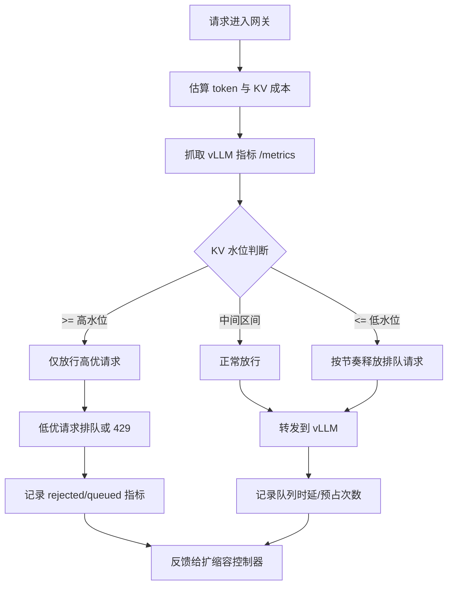

# 基于 vLLM 的 Admission + Token Budget 机制

## 目标

在请求进入 vLLM 调度器之前先做入口治理，把 KV 使用率控制在目标区间
（例如 70% 到 85%），避免 preemption 风暴。

## 基本工作机制

1. 在入口估算请求成本：
   - prompt token 数
   - 请求的最大输出 token 数
   - 预估 KV block 消耗
2. 读取引擎实时压力：
   - `kv_cache_usage_perc`
   - waiting 请求数
   - preemption 增长速度
3. 按请求类别做 admission 决策：
   - 放行
   - 在网关排队
   - 丢弃（429 或降级）
4. 使用滞回控制：
   - 高水位进入保护模式
   - 低水位退出保护模式

## 方案流程图



## 与 vLLM 的对接点

- vLLM 暴露的指标：
  - `vllm:kv_cache_usage_perc`
  - `vllm:num_requests_waiting`
  - `vllm:num_preemptions`
  - `vllm:request_queue_time_seconds`
  - 参考：`vllm/v1/metrics/loggers.py`
- 可选轻量负载接口：
  - `GET /load`
  - 参考：`vllm/entrypoints/serve/instrumentator/basic.py`
- 调度容量参数：
  - `--max-num-batched-tokens`
  - `--max-num-seqs`
  - `--max-num-partial-prefills`
  - `--long-prefill-token-threshold`
  - 参考：`vllm/engine/arg_utils.py`, `vllm/config/scheduler.py`

## 最小部署形态

1. 在一个或多个 vLLM 实例前放置 ingress 控制器。
2. 每 1 到 2 秒抓取一次每个实例的 `/metrics`。
3. 将指标转成实例压力分数。
4. 在转发到 vLLM 前执行 admission 规则。
5. 持续记录 rejected/queued 统计，作为后续 autoscaling 输入。

## MVP 规则示例

```text
if kv_usage >= 0.90:
  仅放行 P0 请求（或拒绝所有新 prefill）
elif kv_usage >= 0.85:
  低优请求进入网关队列
elif kv_usage <= 0.75:
  按节奏释放排队请求
else:
  正常放行
```

## 为什么适配 vLLM

vLLM 内部调度是单引擎内决策，通常在分配失败后才被动反应。  
admission 能在引擎压力失稳前做主动控制。

## 风险与护栏

- 风险：丢弃策略过激会损伤吞吐。
- 护栏：按业务分级治理，避免全局硬拒绝。
- 风险：指标滞后导致误判。
- 护栏：设置指标 TTL，并在异常时回退到保守模式。
