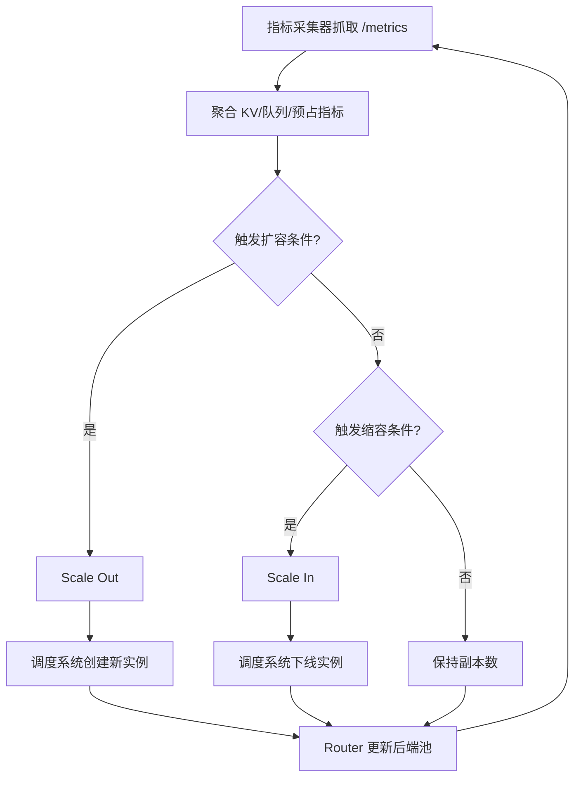

# 基于 vLLM 指标的 Autoscaling

## 目标

使用 LLM 原生压力信号驱动 vLLM 扩缩容，而不是只依赖 CPU 或内存指标。

## 基本工作机制

1. 持续抓取每个实例的 `/metrics`。
2. 从 LLM 指标构建扩缩容信号。
3. 在队列爆炸前提前扩容。
4. 仅在压力稳定一段冷却窗口后再缩容。

## 方案流程图



## 与 vLLM 的对接点

- 核心指标：
  - `vllm:num_requests_waiting`
  - `vllm:num_requests_running`
  - `vllm:kv_cache_usage_perc`
  - `vllm:num_preemptions`
  - `vllm:request_queue_time_seconds`
  - 参考：`vllm/v1/metrics/loggers.py`
- 引擎侧未完成请求信号：
  - `get_num_unfinished_requests()`
  - 参考：`vllm/v1/engine/llm_engine.py`
- 可选轻量接口：
  - `GET /load`
  - 参考：`vllm/entrypoints/serve/instrumentator/basic.py`

## 最小扩缩容策略

```text
scale_out if any:
  waiting_requests > W_high
  kv_usage > K_high for T seconds
  queue_time_p95 > Q_high

scale_in if all:
  waiting_requests < W_low
  kv_usage < K_low for T_low seconds
```

## 部署形态

1. 指标采集器 -> 时序存储后端。
2. 策略控制器 -> 水平扩缩容器。
3. Router 动态更新后端实例池。
4. 保留一定 warm 实例应对突发流量。

## 为什么适配 vLLM

vLLM 已暴露队列和 KV 的关键指标，可直接用于稳定扩缩容决策。

## 风险与护栏

- 风险：扩缩容振荡。
- 护栏：滞回 + 冷却时间。
- 风险：冷启动延迟掩盖真实压力。
- 护栏：设置最小预热副本 + 突发缓冲队列。
