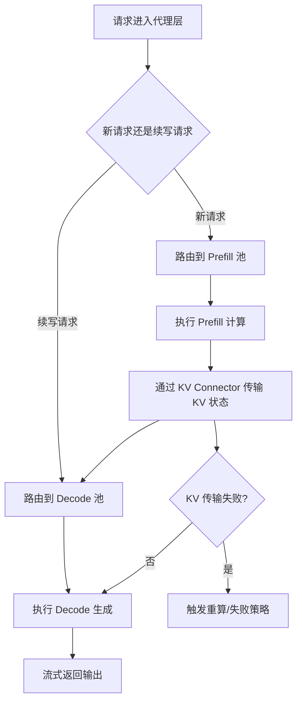

# 基于 vLLM 的 Prefill/Decode 解耦

## 目标

将 prefill 重负载与 decode 重负载拆开，减少互相干扰，并支持独立扩缩容。

## 基本工作机制

1. 分别运行 prefill 实例池和 decode 实例池。
2. Prefill 实例执行 prompt 阶段并传输 KV 状态。
3. Decode 实例接管并继续生成 token。
4. 两个池子按各自压力信号独立扩缩容。

## 方案流程图



## 与 vLLM 的对接点

- vLLM 支持 KV 传输连接器配置：
  - `--kv-transfer-config`
  - 参考：`vllm/engine/arg_utils.py`
- KV 传输实现目录：
  - `vllm/distributed/kv_transfer`
- 官方功能和示例：
  - `docs/features/disagg_prefill.md`
  - `examples/online_serving/disaggregated_prefill.sh`
  - `examples/online_serving/disaggregated_serving`
- 可选 KV 事件流观测：
  - `--kv-events-config`
  - 参考：`vllm/engine/arg_utils.py`

## 最小部署形态

1. 至少部署一个 prefill 服务和一个 decode 服务。
2. 两侧启用同一连接器族。
3. Proxy 路由规则：
   - 新请求 -> prefill 池
   - 后续 decode -> decode 池
4. 采集 KV 传输成功率和传输时延。

## MVP 运行规则

```text
if decode_pool ITL tail grows:
  降低进入同一路径的 prefill 流量
if prefill_pool queue grows:
  仅扩 prefill 池
```

## 为什么适配 vLLM

vLLM 已有连接器抽象；你需要补的是拓扑编排和控制逻辑。

## 风险与护栏

- 风险：KV 传输失败触发重算，尾时延飙升。
- 护栏：明确失败策略 + 金丝雀发布。
- 风险：额外网络跳数抵消收益。
- 护栏：必须基于真实 prompt 长度分布压测。
