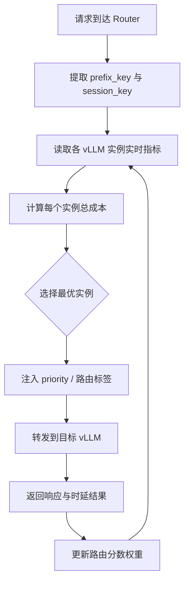

# 基于 vLLM 的 Prefix + KV 感知路由

## 目标

不再使用简单轮询，而是结合前缀亲和性和实时压力，把请求路由到“最合适”的
vLLM 实例。

## 基本工作机制

1. 构建可选 vLLM 后端集合。
2. 对每个后端计算路由分数，分数由以下部分组成：
   - prefix 亲和分
   - KV 压力分
   - 队列深度分
3. 选择总成本最低的后端。
4. 对多轮会话启用 sticky 路由。

## 方案流程图



## 与 vLLM 的对接点

- Prefix 相关能力：
  - vLLM 内部支持 prefix caching。
  - 参考：`vllm/v1/core/kv_cache_manager.py`
- 实时压力指标：
  - `vllm:kv_cache_usage_perc`
  - `vllm:num_requests_waiting`
  - 参考：`vllm/v1/metrics/loggers.py`
- 请求优先级字段：
  - OpenAI 协议支持 `priority`。
  - 参考：`vllm/entrypoints/openai/engine/protocol.py`
- 引擎内部请求对象也携带优先级：
  - 参考：`vllm/v1/request.py`

## 建议评分公式

```text
total_cost =
  w1 * (1 - prefix_affinity)
  + w2 * kv_usage
  + w3 * normalized_waiting
  + w4 * normalized_preemption_rate
```

## 最小部署形态

1. Router 维护每个后端最近 1 到 2 秒的指标快照。
2. Router 计算分数并转发请求。
3. Router 按请求类别注入 `priority`。
4. Router 维护会话粘性键，保证会话连续性。

## MVP 伪代码

```text
for backend in backends:
  score[backend] = score_fn(prefix_key, metrics[backend])
pick = argmin(score)
forward(request, pick)
```

## 为什么适配 vLLM

vLLM 擅长单实例内调度；Prefix/KV 感知路由补足的是集群层优化。

## 风险与护栏

- 风险：基于旧指标路由，决策失真。
- 护栏：心跳超时 + 熔断。
- 风险：prefix 信号误判，反而破坏局部性。
- 护栏：先保守使用 prefix 亲和，优先压力信号兜底。
