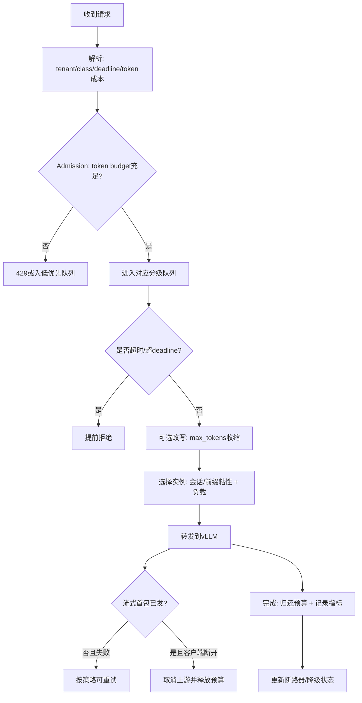

# vLLM 引擎已启动后：转发层可落地的请求处理策略

## 先澄清边界

你的问题是对的：这里不讨论如何 `vllm serve` 启服务。  
只讨论“引擎已经在跑”之后，网关/转发层在收到请求时还能做什么。

核心边界：

1. 不改 vLLM 内核调度代码。
2. 不依赖重启引擎。
3. 只用上层可控手段（请求准入、队列、改写、降级、回压、拒绝、重试治理）。

## 可做的 10 类策略（按优先级）

### 1) Token Budget 准入控制（Admission）

怎么做：

1. 为每个实例维护“虚拟 token 预算”。
2. 每个请求入队前先估算成本：`estimated_cost = prompt_tokens + alpha * max_tokens`。
3. 预算不足则排队或直接 429（带 `Retry-After`）。
4. 请求完成后归还预算（按真实 token 修正）。

价值：

1. 比“只看并发数”更贴近 KV 压力。
2. 能主动把 `kv_cache_usage_perc` 稳在目标水位（如 80%）。

### 2) 多队列分级（Class-based Queue）

怎么做：

1. 至少拆三类：`interactive`（低延迟）、`default`、`long_context/batch`。
2. 每类有独立并发上限和队列上限。
3. 调度时按权重轮转或最小等待时间优先。

价值：

1. 避免长上下文请求“淹没”交互请求。
2. 降低 p95/p99 抖动。

### 3) Deadline/TTL 感知排队

怎么做：

1. 请求携带 `deadline_ms`（或网关默认 SLA）。
2. 入队后若“预计等待 + 执行时间”超过 deadline，提前拒绝。
3. 队列超时请求不再下发引擎。

价值：

1. 避免无意义排队占坑。
2. 对用户体验更可控。

### 4) 动态 max_tokens 收缩（Request Shaping）

怎么做：

1. 正常水位：按用户请求透传。
2. 当 `gpu_cache_usage_perc > 0.8`：把普通请求 `max_tokens` 收缩到档位上限。
3. 当 `> 0.9`：仅允许高优请求维持原上限。

价值：

1. 在不拒绝全部流量的情况下快速降压。
2. 把“硬拒绝”变成“可控降级”。

### 5) Prefix/Session 粘性路由

怎么做：

1. 相同系统提示词、相同会话优先路由到同实例。
2. 若目标实例排队过深，再回退到次优实例。

价值：

1. 提高 prefix cache 命中率。
2. 降低 prefill 成本与 TTFT。

### 6) 微批聚合（仅 embeddings/rerank）

怎么做：

1. 对短请求开 10-30ms 聚合窗口。
2. 达到 batch 条件就一次下发。
3. chat/completions 一般不做这类强聚合（除非明确离线场景）。

价值：

1. 提高吞吐且不明显恶化体验。
2. 对非流式任务收益稳定。

### 7) 回压与排队上限（Backpressure）

怎么做：

1. 设置全局与分队列上限。
2. 队列满直接拒绝，不无限排队。
3. 对调用方返回标准化错误码和重试建议。

价值：

1. 避免“慢性雪崩”（全链路越积越慢）。
2. 保护引擎与网关自身稳定性。

### 8) 重试治理（仅首包前 + 幂等）

怎么做：

1. 只在“未开始流式输出”前允许重试。
2. 限定可重试错误（连接失败、网关超时、502/503/504）。
3. 流式响应一旦出首字节，不再自动重试。

价值：

1. 防止重复生成与成本翻倍。
2. 减少“重试风暴”。

### 9) 取消传播（Cancel Propagation）

怎么做：

1. 客户端断开时立刻取消上游请求。
2. 终止本地队列中的同请求后续动作。
3. 记录取消原因（client disconnect/timeout/policy shed）。

价值：

1. 释放算力与 KV 占用。
2. 降低无效 token 生成。

### 10) 断路器与降级模式（Circuit Breaker）

怎么做：

1. 指标触发条件：等待队列、TTFT、5xx、KV 水位。
2. 开启降级模式：
   - 限制长请求
   - 只放行高优请求
   - 关闭非关键功能路径
3. 恢复条件满足后自动退出降级。

价值：

1. 让系统在高压时“有控制地变差”，而不是随机崩溃。

## 与你当前代码形态的直接映射

你们已有：`QueueGate`、固定间隔重试、流/非流分流、健康探测。  
可直接增量改造：

1. 在 `gate.acquire()` 前加 `token_budget_admit()`。
2. 在 `read_json_body` 后加 `max_tokens` 动态收缩。
3. 在 `_send_with_fixed_retries` 前加 `deadline` 判断。
4. 在 `_stream_gen` / 非流转发里强化 `is_disconnected()` 后的上游取消。
5. 在 `/metrics` 拉取值基础上驱动断路器状态机。

## 统一处理流程图（转发层）

## 最小落地顺序（2 周版本）

1. 第 1 步：`token budget admission + queue TTL + 429 retry-after`。
2. 第 2 步：`max_tokens` 动态收缩 + 分级队列。
3. 第 3 步：断路器（按 `kv_cache_usage_perc`、`num_requests_waiting`、`TTFT`）。
4. 第 4 步：embeddings/rerank 微批。

## 结论

在“内核之上”的最佳抓手不是再造调度器，而是：  
`准入控制 + 分级队列 + 动态降级 + 取消传播 + 断路器`。  
这套组合比单点参数调优更适合真实复杂流量。