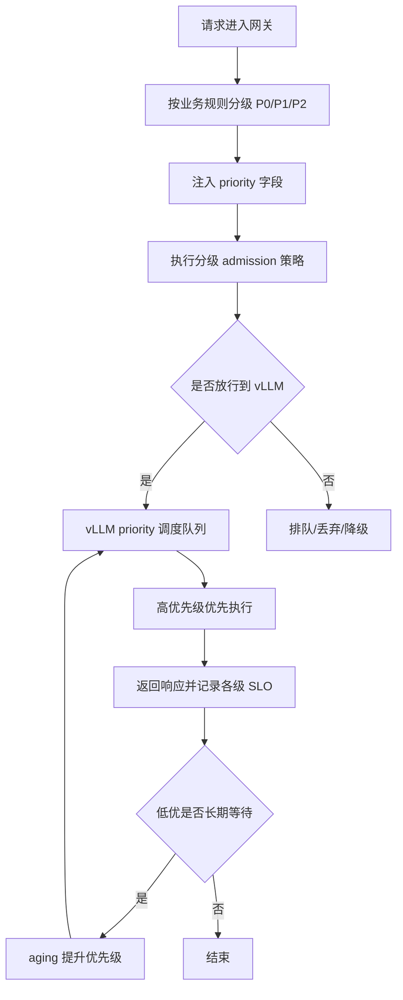

# 基于 vLLM 的 SLO 与优先级分层

## 目标

按 SLO 对流量分层，避免高优在线流量被长上下文或离线批处理流量拖垮。

## 基本工作机制

1. 定义请求等级：
   - P0 交互在线
   - P1 标准在线
   - P2 批处理/离线
2. 对不同等级应用不同 admission 与排队策略。
3. 将等级映射到请求 `priority`。
4. 压力升高时按等级执行分层 shedding。

## 方案流程图



## 与 vLLM 的对接点

- 请求协议支持 `priority`：
  - 参考：`vllm/entrypoints/openai/engine/protocol.py`
  - 参考：`vllm/entrypoints/openai/chat_completion/protocol.py`
  - 参考：`vllm/entrypoints/openai/completion/protocol.py`
- 调度策略开关：
  - `--scheduling-policy`（`fcfs` 或 `priority`）
  - 参考：`vllm/engine/arg_utils.py`
- 优先级排序实现：
  - `Request.__lt__`
  - 参考：`vllm/v1/request.py`
- 可选自定义调度器：
  - `--scheduler-cls`
  - 参考：`vllm/engine/arg_utils.py`, `vllm/config/scheduler.py`

## 最小等级映射

```text
P0 -> priority 0
P1 -> priority 5
P2 -> priority 10
```

## 最小部署形态

1. 在入口做请求分级。
2. 将 `priority` 注入 vLLM 兼容请求。
3. 在 vLLM 开启 `priority` 调度策略。
4. 执行按等级 shedding：
   - 优先丢弃 P2
   - P1 进入排队
   - 尽量保护 P0

## 为什么适配 vLLM

vLLM 已具备优先级队列能力；你只需要叠加业务 SLO 策略，尽量少改引擎代码。

## 风险与护栏

- 风险：低优请求长期饥饿。
- 护栏：引入等待时长 aging 提升优先级。
- 风险：业务方滥用高优标签。
- 护栏：仅允许可信网关注入分级结果。
