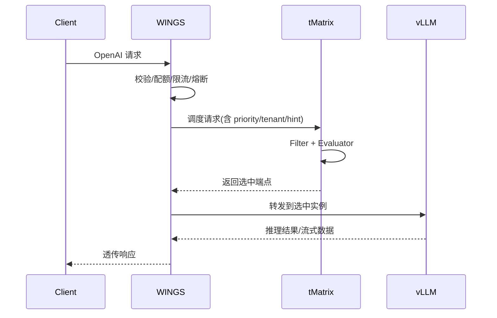
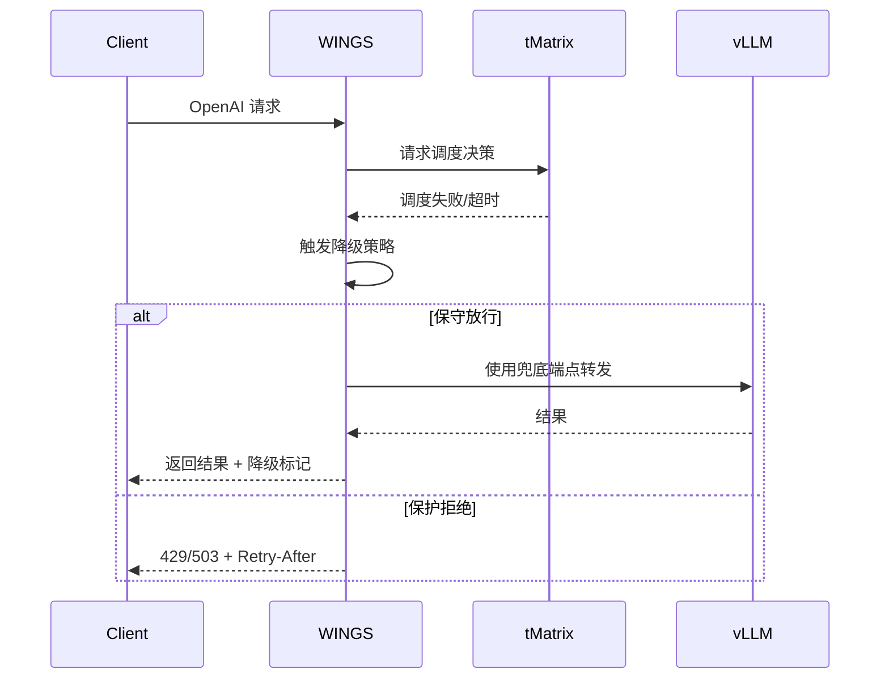

# WINGS 与 tMatrix 职责边界（vLLM 场景）

## 目标

在不重复建设的前提下，明确 WINGS（你们组）与 tMatrix（对方组）的职责边界。  
原则：`WINGS 做边缘治理与协议网关`，`tMatrix 做路由控制与调度决策`，`vLLM 做推理执行`。

## 角色定义

1. WINGS（边缘代理层）
   - 负责 OpenAI 协议入口、请求校验、基础重试、流式透传、限流熔断、租户配额、降级编排。
   - 不负责端点打分、实例发现、KV-aware 路由算法。
2. tMatrix（控制面/调度层）
   - 负责服务发现、端点过滤、评估打分、路由选择、调度降级、KV-aware 策略。
   - 对外提供“已选择后端”的调度决策结果。
3. vLLM（执行层）
   - 负责模型推理、KV 管理、指标暴露、推理接口响应。

## 能力归属矩阵

| 能力 | WINGS | tMatrix | vLLM |
|---|---|---|---|
| OpenAI 接口接入与透传 | 主责 | 辅助（可选） | 执行 |
| 请求体校验、大小限制、协议规范化 | 主责 | 否 | 否 |
| 多端点服务发现（ETCD/K8S） | 否 | 主责 | 否 |
| 端点过滤链（health/model/kv role） | 否 | 主责 | 否 |
| 多策略评分路由（KV-aware/SLA 等） | 否 | 主责 | 否 |
| 限流、熔断、租户配额 | 主责 | 可感知 | 否 |
| 调度失败降级策略 | 协同 | 主责 | 否 |
| 推理指标采集与暴露 | 消费方 | 消费方 | 主责 |
| KV transfer/offload 参数执行 | 透传配置 | 编排策略 | 主责 |

## 禁止重叠清单（避免重复建设）

1. WINGS 不实现第二套“端点打分路由器”。
2. WINGS 不维护第二套服务发现（ETCD/K8S watcher）。
3. WINGS 不实现与 tMatrix 同类的 KV-aware 路由算法。
4. tMatrix 不实现入口协议治理（请求体硬校验、大小限制、头字段规范化）。
5. tMatrix 不替代 WINGS 的边缘限流熔断与租户配额执行。

## 推荐调用拓扑

`Client -> WINGS -> tMatrix -> vLLM`

其中：
1. WINGS 做入口校验与保护（Admission/QoS/限流）。
2. tMatrix 产出调度决策（选择实例）。
3. vLLM 专注执行推理。

## 协作流程图（正常路径）

## 协作流程图（降级路径）

## 落地清单

1. 明确唯一路由权威：tMatrix。
2. WINGS 仅保留“转发 + 入口治理 + 降级编排”。
3. 在接口契约中固定字段与错误码（见下一份文档）。
4. 所有策略切换增加灰度开关与回滚开关。
5. 指标看板按职责拆分：入口层、调度层、执行层。

