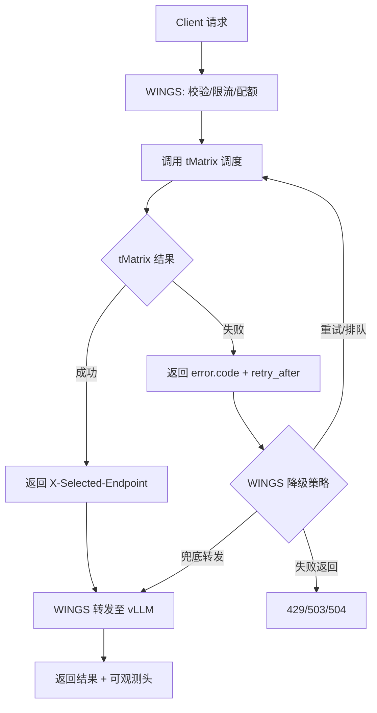

# WINGS x tMatrix 接口契约草案（v1）

## 目标

定义 WINGS 与 tMatrix 的最小可执行契约，保证两边可独立演进、可灰度、可回滚。

## 协议原则

1. 业务请求协议保持 OpenAI 兼容。
2. 控制字段通过 HTTP Header 传递，不污染请求体语义。
3. 错误返回统一结构，必须包含机器可解析 `code`。
4. 所有决策都可观测：请求 ID、选中端点、降级原因、重试次数。

## 请求头契约（WINGS -> tMatrix）

| Header | 必填 | 示例 | 说明 |
|---|---|---|---|
| `X-Request-Id` | 是 | `req-abc-123` | 全链路唯一请求 ID |
| `X-Tenant-Id` | 是 | `tenant-a` | 租户标识 |
| `X-SLO-Class` | 是 | `P0` | `P0/P1/P2` |
| `X-Request-Priority` | 是 | `0` | 数值越小优先级越高 |
| `X-Routing-Policy` | 否 | `kv_aware` | 指定策略，缺省为 `auto` |
| `X-Routing-Hint` | 否 | `session:xxx` | 会话粘性/业务提示 |
| `X-Max-Latency-Ms` | 否 | `8000` | 端到端期望上限 |
| `X-Queue-Timeout-Ms` | 否 | `300` | 入口排队容忍时长 |
| `X-Max-Tokens-Budget` | 否 | `4096` | 请求预算上限 |

## 响应头契约（tMatrix -> WINGS）

| Header | 必填 | 示例 | 说明 |
|---|---|---|---|
| `X-Selected-Endpoint` | 是 | `http://10.0.0.8:17000` | 调度选中的后端 |
| `X-Scheduler-Policy` | 是 | `KVAwarePreble` | 生效策略 |
| `X-Scheduler-Score` | 否 | `0.172` | 选中端点评分 |
| `X-Scheduler-Decision-Id` | 否 | `sch-20251001-001` | 调度决策 ID |
| `X-Degrade-Mode` | 否 | `continue_random` | 是否触发降级 |
| `X-Retry-After-Ms` | 否 | `200` | 建议重试等待 |

## 错误体契约（统一）

```json
{
  "error": {
    "code": "TMX_QUEUE_FULL",
    "message": "operation queue is full",
    "type": "scheduler_error",
    "retry_after_ms": 200
  },
  "request_id": "req-abc-123"
}
```

## 错误码建议

| HTTP | Code | 说明 | 处理建议 |
|---|---|---|---|
| `429` | `TMX_QUEUE_FULL` | 调度队列已满 | 按 `retry_after_ms` 重试 |
| `429` | `TMX_TENANT_RATE_LIMITED` | 租户配额超限 | 降级或排队 |
| `503` | `TMX_NO_HEALTHY_ENDPOINT` | 无可用端点 | 熔断并快速失败 |
| `503` | `TMX_CIRCUIT_OPEN` | 目标池熔断中 | 走兜底池或失败 |
| `504` | `TMX_SCHEDULER_TIMEOUT` | 调度决策超时 | 启动降级分支 |
| `502` | `UPSTREAM_CONNECT_ERROR` | 执行层连接失败 | 受控重试 |

## WINGS 侧行为契约

1. 若 tMatrix 返回 `X-Selected-Endpoint`，WINGS 必须按该地址转发。
2. 若 tMatrix 返回可重试错误（`429/503/504`），WINGS 按策略选择：
   - 排队重试
   - 兜底端点
   - 快速失败
3. WINGS 必须回传可观测字段：
   - `X-Request-Id`
   - `X-Retry-Count`
   - `X-Degrade-Mode`（若发生）

## tMatrix 侧行为契约

1. 必须保证调度决策可追踪：`X-Scheduler-Decision-Id`。
2. 失败必须返回机器可解析 `error.code`。
3. 若开启降级继续执行，必须显式标记 `X-Degrade-Mode`。
4. 指标名建议兼容：
   - `vllm:gpu_cache_usage_perc`
   - `vllm:kv_cache_usage_perc`

## 交互流程图（契约视角）



## 版本化与兼容

1. 新增 Header 必须向后兼容，默认可忽略。
2. 错误码只能新增不能复用语义。
3. 建议在响应头增加 `X-Contract-Version: wings-tmx-v1`。

